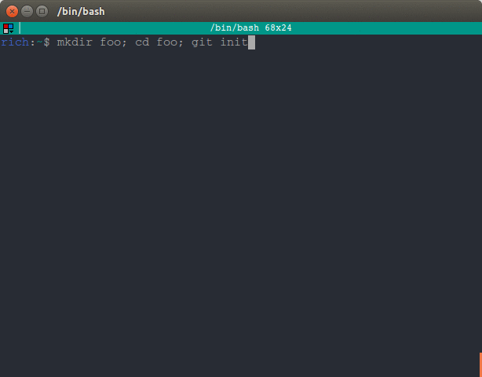

# Git prompt
Quick show


Quick Use:

Open the terminal and make dir named `.git-prompt`, inside clone the repository

```shell
mkdir ~/.git-prompt
cd ~/.git-prompt
git clone https://github.com/rich-97/git-prompt
```

After, write the following lines in your `.bashrc`.

```shell
export GIT_PROMPT=~/.git-prompt/git-prompt
source "${GIT_PROMPT}/main.sh"
```

Enjoy!
